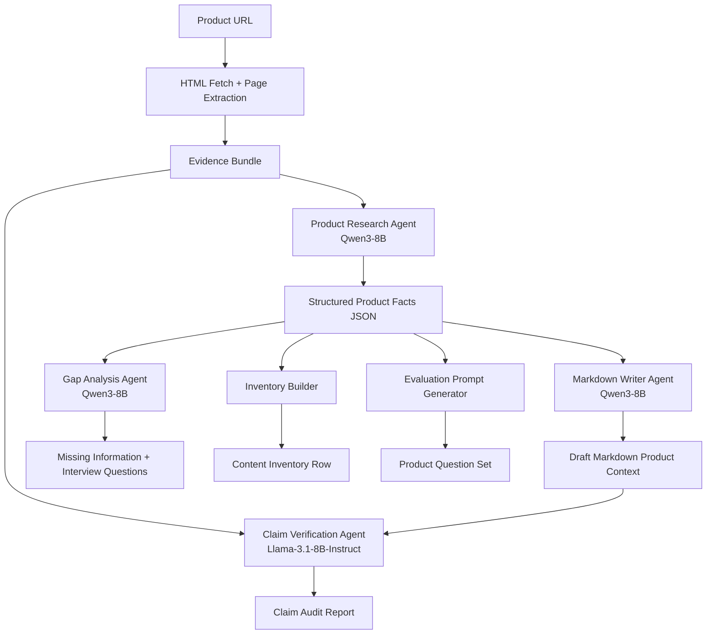

# AI Search Content Copilot

> Paste any public product webpage URL — the multi-agent workflow extracts structured facts, drafts a markdown content file, audits every claim against the source, and surfaces information gaps for human review.

---

## What It Does

**AI Search Content Copilot** is an agentic AI pipeline that turns any product webpage into a structured, evidence-grounded content package in one click. It is designed for marketers, content teams, and researchers who need to:

- quickly understand what a product page actually says,
- produce a clean, structured markdown knowledge file,
- verify that no claims were invented or exaggerated,
- identify what information is missing from the page.

The system works with **any brand's product webpage** — supplements, skincare, electronics, food, pet products, household goods, or anything else publicly accessible.

---

## Features

| Feature | Description |
|---|---|
| Universal URL input | Works with any publicly accessible product page |
| Multi-agent pipeline | Separate agents for extraction, writing, auditing, and gap analysis |
| Claim-level audit | Every non-trivial claim is classified as supported, partially supported, unsupported, or needs review |
| Gap analysis | Surfaces missing information and generates questions for internal product experts |
| Structured JSON output | Validated schemas for facts, audit, gaps, and inventory |
| Downloadable artifacts | Markdown draft, claim audit JSON, content gaps JSON, inventory row |
| Human-in-the-loop design | All outputs are drafts for human review, never auto-published |
| Small open models | Uses models ≤ 8B via Hugging Face Inference API — no expensive frontier API required |

---

## Demo

```
Paste any product URL
        ↓
Webpage Extraction (HTML + trafilatura)
        ↓
Evidence Bundle (headings, paragraphs, bullets, tables, JSON-LD)
        ↓
Product Research Agent  →  Structured Product Facts JSON
        ↓
Markdown Writer Agent   →  Draft Product Context File
        ↓
Claim Verification Agent  →  Claim Audit Report (supported / unsupported / needs review)
        ↓
Gap Analysis Agent      →  Missing Information + Expert Interview Questions
        ↓
Review Package (all artifacts available to download)
```

---

## Architecture



### Agent Roles

| Agent | Model | Purpose |
|---|---|---|
| Product Research Agent | `Qwen/Qwen3-8B` | Converts the evidence bundle into a structured product-fact schema with evidence snippets |
| Markdown Writer Agent | `Qwen/Qwen3-8B` | Drafts a clean, non-hyped markdown content file from the structured facts |
| Claim Verification Agent | `meta-llama/Llama-3.1-8B-Instruct` | Independently audits every claim in the draft against the source evidence |
| Gap Analysis Agent | `Qwen/Qwen3-8B` | Identifies missing information and generates expert interview questions |

Two different models are used intentionally: one model writes, a separate model reviews, reducing self-confirmation bias.

---

## Output Artifacts

Each run produces:

| File | Description |
|---|---|
| `product_facts.json` | Structured product knowledge schema with evidence |
| `product_context.md` | Markdown content file ready for review |
| `claim_audit.json` | Claim-level audit with support status and recommended actions |
| `content_gaps.json` | Missing sections, unclear claims, expert questions |
| `inventory_row.json` | Single-row content inventory entry |
| `evaluation_questions.json` | Question set for downstream AI evaluation |

---

## Quickstart

### 1. Clone the repository

```bash
git clone https://github.com/your-username/ai-search-content-copilot.git
cd ai-search-content-copilot
```

### 2. Install dependencies

```bash
pip install -r requirements.txt
```

### 3. Set up environment variables

```bash
cp .env.example .env
```

Edit `.env` and add your Hugging Face token:

```bash
HF_TOKEN=your_huggingface_token_here
GENERATOR_MODEL=Qwen/Qwen3-8B
REVIEWER_MODEL=meta-llama/Llama-3.1-8B-Instruct
```

You need a [Hugging Face account](https://huggingface.co) with Inference API access. Both models are free-tier eligible.

### 4. Run the app

```bash
streamlit run app/streamlit_app.py
```

Then open `http://localhost:8501`, paste a product page URL, and click **Run Agentic GEO Workflow**.

---

## Usage

1. Open the app in your browser.
2. Enter your Hugging Face token in the sidebar (or set it in `.env`).
3. Paste any public product page URL.
4. Optionally select a product line category and add internal notes.
5. Click **Run Agentic GEO Workflow**.
6. Review the results across seven tabs:
   - **Extracted Evidence** — what was pulled from the page
   - **Product Facts** — structured JSON extracted by the Research Agent
   - **Markdown Draft** — the generated content file
   - **Claim Audit** — claim-by-claim support assessment
   - **Content Gaps** — missing information and expert questions
   - **Inventory Row** — single-row content tracker entry
   - **Evaluation Questions** — question set for testing the content downstream
7. Download any artifact as JSON or Markdown.

---

## Project Structure

```
ai-search-content-copilot/
│
├── README.md
├── requirements.txt
├── .env.example
│
├── app/
│   └── streamlit_app.py          # Streamlit UI
│
├── src/
│   ├── webpage_extractor.py      # HTML fetch + evidence bundle builder
│   ├── llm_client.py             # Hugging Face Inference API client
│   ├── schemas.py                # Pydantic output schemas
│   └── agents/
│       ├── product_research_agent.py
│       ├── markdown_writer_agent.py
│       ├── claim_verifier_agent.py
│       └── gap_analysis_agent.py
│
├── outputs/
│   └── eval/                     # Sample evaluation outputs
│
└── evaluate.py                   # Offline evaluation script
```

---

## Tech Stack

- **Python 3.11+**
- **Streamlit** — UI
- **Hugging Face Inference API** — hosted model inference (no GPU required)
- **Pydantic v2** — structured output validation
- **BeautifulSoup4 + trafilatura** — HTML parsing and clean text extraction
- **Playwright** (optional fallback) — JavaScript-rendered pages
- **python-dotenv** — environment variable management

---

## Environment Variables

| Variable | Default | Description |
|---|---|---|
| `HF_TOKEN` | — | Hugging Face API token (required) |
| `GENERATOR_MODEL` | `Qwen/Qwen3-8B` | Model used for extraction, writing, and gap analysis |
| `REVIEWER_MODEL` | `meta-llama/Llama-3.1-8B-Instruct` | Independent model used for claim verification |

---

## Design Principles

- **Evidence-grounded only** — agents are instructed never to invent claims; `unknown` is a valid output.
- **Human-in-the-loop** — all outputs are drafts; nothing is auto-published.
- **Separation of concerns** — writing and reviewing are done by different models to reduce self-confirmation.
- **Conservative claim labelling** — the verifier classifies borderline claims as `needs_internal_confirmation` rather than `supported`.
- **Small models, structured workflow** — task decomposition matters more than model size.

---

## Limitations

- Public product pages may not contain all information needed (formulation details, sourcing, internal brand context).
- Small models can still hallucinate even with structured prompts — human review is always required.
- Web extraction may miss content loaded dynamically or hidden in interactive components.
- Pages behind login walls or paywalls cannot be accessed.
- This tool structures and reviews content; it does not guarantee search visibility in any AI search engine.

---

## Responsible Use

1. Do not fabricate product claims.
2. Do not use generated content without human review, especially for health, wellness, or legal claims.
3. Keep a clear boundary between sourced facts and inferred summaries.
4. Escalate uncertain statements rather than smoothing them over.
5. Use this as a drafting and QA assistant, not a final publishing authority.

---

## Vision: Where This Goes Next

This prototype is the **first production layer** — it turns public product pages into structured, grounded, reviewable AI-search content.

The next step is a **feedback-driven GEO optimization loop**:

```
Current (Layer 1)                       Future (Layer 2)
─────────────────────────────           ──────────────────────────────────────
Product page URL                        Structured content files (from Layer 1)
        ↓                                       ↓
Extract → Structure → Audit → Gap   →   Test how generative search systems
                                        represent the content for realistic
                                        customer queries
                                                ↓
                                        Identify where visibility or factual
                                        coverage is weak
                                                ↓
                                        Choose targeted revision strategies
                                        (not one fixed template for every page)
                                                ↓
                                        Human review → publish revised content
```

Rather than applying one fixed optimization template to every page, Layer 2 would be **content-specific and feedback-driven**: it tests actual generative search representation, finds weak spots, and selects revision strategies matched to each product's gaps.

This direction is supported by recent research:
- **AutoGEO** — shows that LLMs can learn the preferences of generative engines and use those preferences to guide content rewrites systematically.
- **AgenticGEO** — explores adaptive, multi-step GEO using agentic reasoning and feedback-oriented refinement rather than static rewriting.

The guiding principle stays the same throughout both layers: **the goal is more useful and trustworthy content, not manipulation**. Every revision should make the product easier to understand accurately — not game a ranking.

---

## License

MIT License — see [LICENSE](LICENSE) for details.
