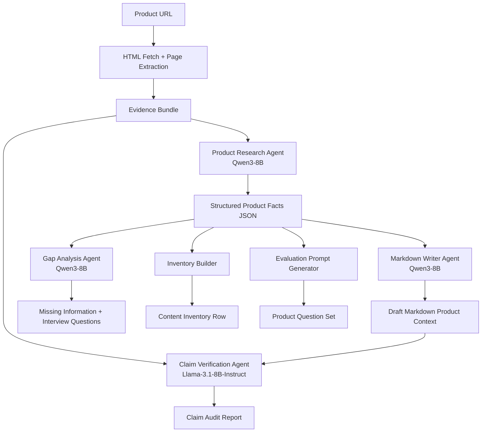

# AI Search Content Copilot
## A Human-in-the-Loop Agentic GEO Prototype for Product Knowledge Structuring

> **Purpose:** This prototype helps a marketing or product-content team transform public product webpages into structured, evidence-grounded markdown content files that are easier to review, maintain, and use in AI-search-oriented workflows.

---

## 1. Project Summary

**AI Search Content Copilot** is a research-grounded prototype that uses a small-model, multi-step agentic workflow to:

1. Extract product information from a public product webpage.
2. Convert the extracted evidence into a structured product knowledge schema.
3. Draft a clean markdown content file covering:
   - formulation philosophy,
   - key ingredients,
   - differentiators,
   - use cases,
   - competitive positioning when the source supports it.
4. Audit the generated content for unsupported or overstated claims.
5. Identify information gaps that should be clarified with internal subject-matter experts.
6. Produce a content-inventory row and evaluation prompts for downstream testing.

The system is designed for a role like **AI Search Optimization Intern**, where the work involves building structured content files, improving product explainability, supporting AI-search readiness, and maintaining factual accuracy.

---

## 2. Why This Project Matters

Product discovery is changing. Consumers increasingly ask AI assistants questions such as:

- “Which dog supplement supports joint and digestive health?”
- “What makes this skincare product different from a generic body spray?”
- “Which company products are designed around a specific formulation philosophy?”
- “What makes this product line more sustainable or distinctive?”

For these systems to represent a brand accurately, the brand’s product knowledge must be:

- explicit,
- structured,
- consistent,
- factually grounded,
- easy to retrieve and summarize.

This prototype explores how an agentic AI workflow can help a team build those structured product knowledge assets efficiently and responsibly.

---

## 3. Project Positioning

### 3.1 What This Prototype Claims

This prototype aims to improve:

- **content structure**,
- **fact extraction**,
- **reviewability**,
- **consistency across product files**,
- **downstream answerability in controlled AI/RAG-style tests**.

### 3.2 What This Prototype Does *Not* Claim

This prototype does **not** claim to:

- guarantee better ranking in Google AI Overviews,
- guarantee better visibility in ChatGPT, Claude, Gemini, or Perplexity,
- prove that markdown files alone improve AI search exposure,
- replace human reviewers or product experts,
- fully automate competitive positioning without evidence and review.

The system should be framed as a **content-readiness and product-knowledge structuring tool**, not as a ranking manipulation tool.

---

## 4. Research Motivation

This project is inspired by emerging research on **Generative Engine Optimization (GEO)** and AI-search evaluation.

### 4.1 GEO: Generative Engine Optimization
Aggarwal et al. introduced GEO as a framework for improving content visibility in generative engines and proposed benchmark-based evaluation of how content changes affect visibility in generated responses.

### 4.2 AutoGEO
AutoGEO explores how LLMs can learn preferences of generative engines and use those preferences to rewrite or optimize web content in a more systematic way.

### 4.3 SAGEO Arena
SAGEO Arena argues that realistic evaluation of generative-search optimization should consider the full pipeline, including retrieval, reranking, and answer generation, rather than only assessing rewritten text in isolation.

### 4.4 AgenticGEO
AgenticGEO explores adaptive, multi-step optimization strategies for GEO using agentic reasoning and feedback-oriented refinement.

### 4.5 Responsible Scope of This Prototype
This prototype borrows the **research spirit** of these works but applies it to a practical marketing workflow:

- grounded extraction,
- structured content production,
- claim verification,
- human-in-the-loop review,
- controlled evaluation rather than overclaiming external ranking effects.

---

## 5. High-Level Use Case

### Input
A public product webpage from Life’s Abundance or another product-focused brand.

### Output
A package of reusable content artifacts:

1. `product_facts.json`
2. `product_context.md`
3. `claim_audit.json`
4. `content_gaps.json`
5. `inventory_row.json`
6. `evaluation_questions.json`

---

## 6. Example End-to-End Workflow

```text
Product URL
   ↓
Webpage Extraction Layer
   ↓
Evidence Bundle
   ↓
Product Research Agent
   ↓
Structured Product Facts
   ↓
Markdown Writer Agent
   ↓
Draft Product Context File
   ↓
Claim Verification Agent
   ↓
Supported / Needs Review / Unsupported Claim Report
   ↓
Gap Analysis Agent
   ↓
Internal Interview Questions + Missing Information
   ↓
Final Review Package
```

---

## 7. System Architecture



---

## 8. Primary Design Choice: Agentic Workflow Instead of One-Shot Generation

A naive version of this project would do:

```text
Product page text → one prompt → markdown file
```

That approach is simple, but it has major weaknesses:

- weak factual control,
- inconsistent structure,
- no transparent extraction step,
- no separation between evidence and writing,
- no claim review,
- difficult evaluation,
- harder to explain in a professional workflow.

This prototype improves on that design by separating the task into clearer stages:

1. **Evidence extraction**
2. **Structured fact extraction**
3. **Markdown drafting**
4. **Claim auditing**
5. **Gap analysis**
6. **Evaluation**

This makes the system:

- easier to debug,
- easier to evaluate,
- safer for product content,
- easier for humans to review,
- more convincing as a workflow prototype.

---

## 9. Target Data Source

### 9.1 Initial Prototype Scope
The prototype should begin with **public Life’s Abundance product webpages**.

Suggested product coverage:

- Pet supplements
- Pet nutrition or care products
- Balanced Axis skincare products
- EnviroAxis or eco-friendly household products

### 9.2 Why Start with Life’s Abundance Only
Starting with one company’s public pages makes the prototype:

- directly aligned with the target role,
- easier to evaluate,
- safer to present,
- more consistent in layout and content style,
- easier to extend later to broader competitor analysis.

### 9.3 What About Competitor Data?
Competitive positioning should be handled conservatively:

- **Version 1:** Use only claims and differentiators present in the company’s own public content.
- **Version 2:** Add competitor webpages or public comparison sources only if careful source tracking and legal/brand review are in place.

---

## 10. Webpage Information Extraction

The system should not send raw HTML directly to the LLM. It should first build a **clean evidence bundle**.

### 10.1 Extraction Stack

Recommended tools:

- `requests` or `httpx` for webpage fetching,
- `BeautifulSoup` for HTML parsing,
- `trafilatura` for readable text extraction,
- optional `Playwright` fallback for JavaScript-rendered pages.

### 10.2 What the Extractor Should Capture

For each product page:

1. URL
2. Page title
3. Meta description, when available
4. H1, H2, H3 headings
5. Product summary text
6. Paragraphs
7. Bullet lists
8. Ingredient lists
9. Directions or usage instructions
10. Frequently asked questions, if present
11. Tables
12. JSON-LD or schema.org structured product metadata, if present
13. Any sections that appear to describe:
    - formulation philosophy,
    - product benefits,
    - product differentiation,
    - intended use cases,
    - quality standards,
    - product line context.

### 10.3 Evidence Bundle Example

```json
{
  "source_url": "https://example.com/product-page",
  "page_title": "Example Product",
  "meta_description": "Short product page summary.",
  "headings": [
    "Why this product matters",
    "Key ingredients",
    "Directions"
  ],
  "paragraphs": [
    "This product is formulated to...",
    "The product page states that..."
  ],
  "bullets": [
    "Ingredient A",
    "Ingredient B"
  ],
  "tables": [],
  "json_ld": {},
  "raw_extracted_text": "..."
}
```

---

## 11. Small-Model Strategy

### 11.1 Why Models ≤ 8B?
This prototype intentionally uses **small open models** rather than frontier closed models. The goal is to show that:

- a well-designed workflow matters,
- structured prompting matters,
- evidence grounding matters,
- smaller hosted models can support useful content operations when the task is decomposed well.

### 11.2 Recommended Models

| Agent Role | Recommended Model | Why |
|---|---|---|
| Product fact extraction | `Qwen/Qwen3-8B` | Strong instruction following and reasoning for a small open model |
| Markdown drafting | `Qwen/Qwen3-8B` | Good for structured long-form generation from extracted facts |
| Gap analysis | `Qwen/Qwen3-8B` | Useful for converting missing fields into human interview questions |
| Claim verification / reviewer | `meta-llama/Llama-3.1-8B-Instruct` | Independent critic model for claim review and supportedness checks |

### 11.3 Hosted Inference
Instead of running these models locally, the prototype can call them through:

- Hugging Face Inference Providers,
- compatible serverless inference APIs,
- or a self-hosted endpoint later if needed.

### 11.4 Why Use Two Models?
Using one model for both writing and reviewing can lead to self-confirmation. A second model acts as an independent reviewer and creates a stronger quality-control story.

---

## 12. Agent Definitions

### 12.1 Product Research Agent

**Purpose:** Convert the evidence bundle into a structured product-fact schema.

**Inputs:**
- evidence bundle,
- product page URL,
- optional product line label.

**Outputs:**
- structured product fields,
- evidence snippets for each major extracted point,
- uncertainty flags.

**Expected fields:**
- product name,
- category,
- one-sentence product description,
- formulation philosophy,
- key ingredients,
- differentiators,
- use cases,
- competitive positioning if explicitly supported,
- claims needing review,
- missing information.

---

### 12.2 Markdown Writer Agent

**Purpose:** Convert the product facts into a polished markdown content file.

**Output sections:**

```markdown
# Product Name

## Product Overview

## Formulation Philosophy

## Key Ingredients

## Differentiators

## Use Cases

## Competitive Positioning

## Claims Requiring Review

## Open Questions for Internal Experts
```

The markdown should:

- remain factual,
- avoid promotional exaggeration,
- make unclear points explicit,
- preserve source-grounded language,
- remain useful to a marketing/content team.

---

### 12.3 Claim Verification Agent

**Purpose:** Review every non-trivial factual statement in the draft markdown.

**Inputs:**
- evidence bundle,
- product facts JSON,
- markdown draft.

**Outputs:**
- claim-level audit,
- support labels,
- evidence snippets,
- revision suggestions.

**Support labels:**
- `supported`
- `partially_supported`
- `unsupported`
- `needs_internal_confirmation`

**Claim audit example:**

```json
[
  {
    "claim": "The product is designed to support multiple wellness needs.",
    "status": "supported",
    "evidence": "The source page explicitly states...",
    "risk_level": "low",
    "recommended_action": "keep"
  },
  {
    "claim": "This product is better than all major competitors.",
    "status": "unsupported",
    "evidence": "",
    "risk_level": "high",
    "recommended_action": "remove"
  }
]
```

---

### 12.4 Gap Analysis Agent

**Purpose:** Identify what is not clear or not present on the webpage, especially for sections required by the role.

**Questions it may generate:**
- What formulation choices are intentionally different from generic products?
- Which ingredients are considered most central to the product’s story?
- Which competitive comparisons are approved by marketing?
- Are there common customer misconceptions this file should prevent?
- Are there safety, usage, or claim boundaries that should be emphasized?

---

### 12.5 Inventory Builder

**Purpose:** Produce a row for tracking content operations.

**Example fields:**

```json
{
  "product_name": "Example Product",
  "product_line": "Pet Supplements",
  "source_url": "https://example.com/product-page",
  "priority": "high",
  "file_status": "draft_generated",
  "claim_review_status": "needs_review",
  "missing_information_count": 3,
  "unsupported_claim_count": 1,
  "recommended_next_step": "Internal review with product expert"
}
```

---

### 12.6 Evaluation Prompt Generator

**Purpose:** Create realistic question prompts that can be used to evaluate whether the structured product file improves downstream answering.

**Example question types:**
- What is the product?
- Who is it for?
- What are the key ingredients?
- What makes it different?
- What formulation philosophy is described?
- How would you summarize its use cases?
- What claims require caution?

---

## 13. Structured Output Schemas

### 13.1 `product_facts.json`

```json
{
  "product_name": "",
  "product_line": "",
  "product_category": "",
  "short_summary": "",
  "formulation_philosophy": {
    "summary": "",
    "evidence": []
  },
  "key_ingredients": [
    {
      "ingredient": "",
      "stated_role": "",
      "evidence": []
    }
  ],
  "differentiators": [
    {
      "point": "",
      "evidence": []
    }
  ],
  "use_cases": [
    {
      "use_case": "",
      "evidence": []
    }
  ],
  "competitive_positioning": [
    {
      "positioning_statement": "",
      "evidence": [],
      "review_needed": true
    }
  ],
  "claims_needing_review": [],
  "missing_information": []
}
```

### 13.2 `content_gaps.json`

```json
{
  "missing_sections": [],
  "unclear_claims": [],
  "recommended_internal_questions": [],
  "recommended_page_improvements": []
}
```

### 13.3 `claim_audit.json`

```json
{
  "summary": {
    "total_claims": 0,
    "supported_claims": 0,
    "partially_supported_claims": 0,
    "unsupported_claims": 0,
    "needs_internal_confirmation": 0
  },
  "claims": []
}
```

---

## 14. Prompting Principles

### 14.1 Extraction Prompt Rules
The Product Research Agent should be instructed to:

- use only provided evidence,
- never invent product claims,
- return `unknown` or empty arrays when information is absent,
- preserve uncertainty,
- attach evidence snippets to extracted facts.

### 14.2 Writing Prompt Rules
The Markdown Writer Agent should be instructed to:

- write concise, clear, non-hyped prose,
- avoid unsupported comparative claims,
- preserve “needs review” items,
- organize content for fast reading and reuse,
- ensure all required sections appear, even if some contain “Information not confirmed from source page.”

### 14.3 Reviewer Prompt Rules
The Claim Verification Agent should be instructed to:

- break the markdown into atomic claims,
- compare each claim to the evidence,
- classify support conservatively,
- flag medical-like or strong superiority wording,
- recommend “remove,” “soften,” or “seek internal confirmation.”

---

## 15. Proposed Demo Interface

A simple Streamlit or Gradio app is enough.

### Left Panel
- Product URL input
- Optional product line selector
- Optional pasted internal notes
- “Run Agentic GEO Workflow” button

### Right Panel Tabs
1. **Extracted Evidence**
2. **Product Facts JSON**
3. **Markdown Draft**
4. **Claim Audit**
5. **Content Gaps**
6. **Inventory Row**
7. **Evaluation Questions**

---

## 16. Evaluation Framework

The evaluation should test whether the agent actually adds value.

### 16.1 Three Levels of Evaluation

#### Level 1: Agent Output Quality
Measures whether the agent correctly extracts and writes content.

#### Level 2: Artifact Quality
Measures whether the generated markdown file is clearer and more reviewable than alternatives.

#### Level 3: Downstream AI Usefulness
Measures whether the generated file improves retrieval and answer generation in a controlled RAG-style test.

---

## 17. Baselines for Evaluation

Compare three systems:

| System | Description |
|---|---|
| Baseline A | Cleaned raw webpage text |
| Baseline B | One-shot LLM prompt: webpage text → markdown |
| Proposed System | Agentic workflow with extraction, writing, claim review, and gap analysis |

This comparison is important because it shows whether the multi-step design is actually better than a simpler alternative.

---

## 18. Evaluation Dataset

### 18.1 Product Coverage
Use:

- 8 to 12 product pages,
- across at least 2 product lines,
- with pages that vary in complexity.

### 18.2 Question Set
For each product, create 6 to 8 evaluation questions.

Expected total:
- **48 to 96 product questions**

### 18.3 Question Categories
- Product identity
- Ingredients
- Formulation philosophy
- Differentiators
- Use cases
- Competitive framing
- Safety/review sensitivity
- Brand or product-line context

---

## 19. Evaluation Metrics

### 19.1 Extraction Metrics

| Metric | Meaning |
|---|---|
| Field coverage | How many expected facts were captured? |
| Field precision | How many extracted facts are correct? |
| Missing fact rate | How many important facts were omitted? |
| Unsupported fact rate | How many facts were invented or not grounded? |
| Schema validity rate | Did outputs follow the expected JSON structure? |

---

### 19.2 Claim Audit Metrics

| Metric | Meaning |
|---|---|
| Supported claim rate | Percentage of claims backed by evidence |
| Unsupported claim rate | Percentage of claims with no evidence |
| Needs-review rate | Percentage of statements appropriately escalated |
| High-risk phrasing count | Count of overly strong or unsafe claims |

Target direction:
- maximize supported claim rate,
- minimize unsupported claim rate,
- accept a reasonable needs-review rate when source pages are incomplete.

---

### 19.3 Human Content Quality Rubric

Score each markdown file from 1 to 5 on:

1. Clarity
2. Completeness
3. Structure
4. Factuality
5. Reviewability
6. Usefulness for product understanding

A reviewer can compare:
- raw text summary,
- one-shot markdown,
- agentic markdown.

---

### 19.4 Retrieval Evaluation

Construct two knowledge collections:

1. Raw cleaned webpage text
2. Agent-generated markdown content files

Then test retrieval using the same product questions.

Suggested retrieval metrics:
- Recall@1
- Recall@3
- Mean Reciprocal Rank (MRR)

Purpose:
- Test whether structured markdown helps surface the right product or fact in a controlled retrieval setting.

---

### 19.5 RAG-Style Answer Evaluation

Use the same answer-generation model and compare:

- RAG using raw webpages
- RAG using structured markdown files

Score generated answers on:

| Criterion | Meaning |
|---|---|
| Correctness | Is the answer factually accurate? |
| Completeness | Does it include the key points? |
| Groundedness | Is it supported by retrieved context? |
| Conciseness | Is it direct and readable? |
| Differentiator quality | Does it explain what is distinctive? |

---

### 19.6 Human Productivity Metrics

Since this is a workflow tool, evaluate efficiency too.

Possible measurements:

| Metric | Manual Approach | Agentic Workflow |
|---|---:|---:|
| Time to first draft | TBD | TBD |
| Number of manual edits | TBD | TBD |
| Number of unsupported claims after review | TBD | TBD |
| Time spent generating internal interview questions | TBD | TBD |

---

## 20. Ablation Study

To evaluate the value of each agent, compare:

| Variant | Description |
|---|---|
| One-shot LLM | Direct webpage → markdown |
| No reviewer | Extract → write markdown |
| No gap analyzer | Extract → write → claim review |
| Full system | Extract → write → claim review → gap analysis |

Compare them on:
- unsupported claim rate,
- human rubric score,
- downstream answer quality,
- reviewer usefulness.

This makes the project feel more like a research-informed prototype than a simple demo.

---

## 21. Recommended Success Criteria

A reasonable target for the prototype:

1. **Schema validity:** ≥ 95%
2. **Unsupported claim rate:** ≤ 5%
3. **Field coverage:** ≥ 80% of human-identified key facts
4. **Agentic markdown preferred over one-shot markdown:** majority of cases
5. **Retrieval Recall@3:** improved over raw webpage baseline
6. **RAG answer completeness:** improved over raw webpage baseline
7. **Draft time:** meaningfully reduced relative to manual-first drafting

These thresholds can be refined after a first pilot.

---

## 22. Suggested Repository Structure

```text
ai-search-content-copilot/
│
├── README.md
├── requirements.txt
├── .env.example
│
├── app/
│   ├── streamlit_app.py
│   └── ui_helpers.py
│
├── src/
│   ├── webpage_extractor.py
│   ├── evidence_bundle.py
│   ├── llm_client.py
│   ├── schemas.py
│   ├── agents/
│   │   ├── product_research_agent.py
│   │   ├── markdown_writer_agent.py
│   │   ├── claim_verifier_agent.py
│   │   └── gap_analysis_agent.py
│   ├── evaluation/
│   │   ├── retrieval_eval.py
│   │   ├── rag_eval.py
│   │   ├── rubric_eval.py
│   │   └── ablation_eval.py
│   └── utils/
│       ├── text_cleaning.py
│       └── file_io.py
│
├── data/
│   ├── urls/
│   │   └── product_urls.csv
│   ├── extracted/
│   ├── generated/
│   └── evaluation/
│
├── outputs/
│   ├── markdown_files/
│   ├── claim_audits/
│   ├── content_gaps/
│   └── dashboards/
│
└── notebooks/
    ├── exploratory_extraction.ipynb
    └── evaluation_analysis.ipynb
```

---

## 23. Suggested Tech Stack

### Core
- Python
- Streamlit or Gradio
- Hugging Face Inference Providers
- Pydantic for schema validation
- BeautifulSoup
- Trafilatura
- Optional Playwright

### Evaluation
- pandas
- scikit-learn
- rank-bm25 or Elasticsearch-like BM25 option
- sentence-transformers for embedding retrieval
- matplotlib for simple charts

---

## 24. Environment Variables

Example `.env` file:

```bash
HF_TOKEN=your_huggingface_token
GENERATOR_MODEL=Qwen/Qwen3-8B
REVIEWER_MODEL=meta-llama/Llama-3.1-8B-Instruct
```

---

## 25. Basic Implementation Plan

### Phase 1: Build Extraction Layer
- Accept a product URL.
- Download page HTML.
- Extract clean content and structural elements.
- Save evidence bundle JSON.

### Phase 2: Build Product Research Agent
- Send evidence bundle to Qwen3-8B.
- Return validated `product_facts.json`.

### Phase 3: Build Markdown Writer
- Generate `product_context.md`.

### Phase 4: Build Claim Verification
- Send evidence + markdown to Llama-3.1-8B-Instruct.
- Return `claim_audit.json`.

### Phase 5: Build Gap Analysis
- Generate missing-information report and interview questions.

### Phase 6: Build Demo UI
- Show each artifact in tabs.

### Phase 7: Build Evaluation
- Create baselines.
- Build question set.
- Evaluate quality, retrieval, and answerability.

---

## 26. Example Demo Script

A concise demo flow for an interview:

1. Paste a Life’s Abundance product page URL.
2. Click **Run Agentic GEO Workflow**.
3. Show the extracted evidence.
4. Show the structured product facts JSON.
5. Show the generated markdown content file.
6. Show the claim audit report:
   - supported,
   - needs review,
   - unsupported.
7. Show the gap-analysis questions that an intern could take to a product expert.
8. Show a small evaluation comparison against a one-shot baseline.

---

## 27. Example Interview Pitch

> “I built this prototype to think concretely about how I would approach the internship. The system takes a product webpage, extracts evidence, converts it into structured product knowledge, drafts the kind of markdown content file described in the role, and then audits its own claims before human review. I kept the system grounded in public source content and used a separate reviewer model to reduce unsupported statements. I also designed an evaluation plan to test whether the structured files improve retrieval and answer quality in a controlled AI-search-style setting. I would not claim it guarantees search visibility, but it makes content production more consistent, reviewable, and measurable.”

---

## 28. Design Critique and Improvements

This section documents the first-draft weaknesses and how the current design improves them.

### 28.1 Weakness: “GEO Tool” Sounds Like Ranking Manipulation
**Problem:**  
A first draft framed the system as a tool to “improve AI search rankings.”

**Why that is weak:**  
That sounds overclaimed and risks appearing manipulative.

**Improved framing:**  
The final design frames it as a:
- product knowledge structuring tool,
- human-in-the-loop content pipeline,
- controlled evaluation prototype.

---

### 28.2 Weakness: One-Shot LLM Generation Is Too Shallow
**Problem:**  
The first design imagined direct webpage → markdown generation.

**Why that is weak:**  
It gives no transparency, no audit trail, and higher hallucination risk.

**Improved framing:**  
The final design separates:
- evidence extraction,
- fact extraction,
- writing,
- claim audit,
- gap analysis,
- evaluation.

---

### 28.3 Weakness: Competitive Positioning Is Risky
**Problem:**  
A first-pass system might invent or exaggerate product differentiation.

**Why that is weak:**  
Competitive claims can be sensitive and require review.

**Improved framing:**  
The final design:
- includes competitive positioning only when supported,
- otherwise flags it,
- generates questions for internal approval.

---

### 28.4 Weakness: No Evaluation Beyond “Looks Good”
**Problem:**  
A demo that only produces markdown does not prove usefulness.

**Why that is weak:**  
It does not show whether the workflow improves anything.

**Improved framing:**  
The final design includes:
- baselines,
- human rubric,
- retrieval evaluation,
- RAG-style answer evaluation,
- ablation study,
- workflow efficiency measures.

---

### 28.5 Weakness: Oversized Models Distract from the Workflow
**Problem:**  
Using very large models can make the project look like brute force.

**Why that is weak:**  
The role is about careful process design, not just model size.

**Improved framing:**  
The final design uses:
- small open models ≤ 8B,
- hosted through inference providers,
- task decomposition for reliability.

---

## 29. Limitations

- Public product pages may not contain all information needed for formulation philosophy or competitive positioning.
- Small models can still hallucinate, even with structured prompts.
- Web extraction may miss content loaded dynamically or hidden in interactive components.
- Retrieval/RAG evaluation is a controlled proxy, not a direct measure of real external AI-search visibility.
- Human review remains necessary, especially for:
  - wellness claims,
  - product benefits,
  - comparative positioning,
  - internal brand knowledge.

---

## 30. Responsible Use Principles

1. Do not fabricate product claims.
2. Do not overstate health, performance, or superiority claims.
3. Keep a clear boundary between sourced facts and inferred summaries.
4. Escalate uncertain statements instead of smoothing them over.
5. Treat AI as a drafting and QA assistant, not a final authority.
6. Use evaluation to test improvement, not to claim unverified real-world impact.

---

## 31. Future Extensions

Possible next steps:

- Add company-level knowledge files:
  - mission,
  - values,
  - quality standards,
  - sustainability principles.
- Add internal-document ingestion when approved.
- Add structured competitor analysis with source tracking.
- Add benchmark reports across product lines.
- Add reviewer feedback loops that update templates.
- Add a dashboard for:
  - file status,
  - review status,
  - missing information,
  - claim-risk trends.
- Add a lightweight strategy layer that selects different content templates by product type.

---

## 32. Recommended Minimum Viable Prototype

If time is limited, build only these:

1. URL input
2. Evidence extraction
3. Structured product facts JSON
4. Markdown content file
5. Claim audit report
6. Gap-analysis questions
7. One small baseline comparison:
   - one-shot LLM markdown vs. agentic markdown

This is already strong enough for an interview demo.

---

## 33. Best Interview Takeaway

The core insight of this project is:

> **The goal is not to “game” AI search. The goal is to build a reliable, research-informed content pipeline that makes product knowledge more explicit, structured, reviewable, and measurable.**

That is the most credible way to connect:
- GEO,
- agentic AI,
- product research,
- content operations,
- and responsible AI-assisted marketing.
